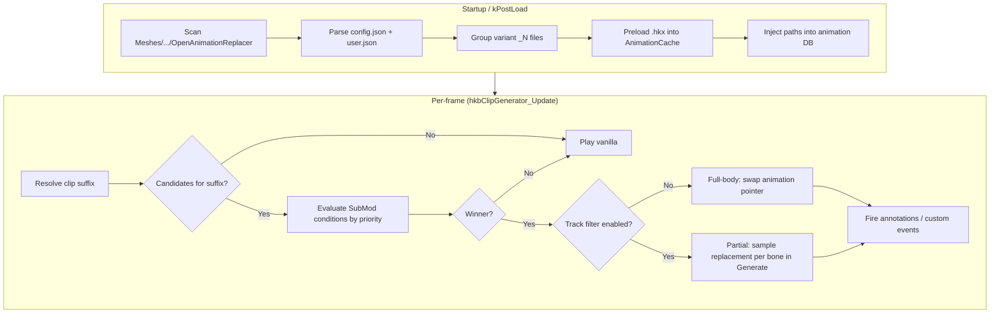
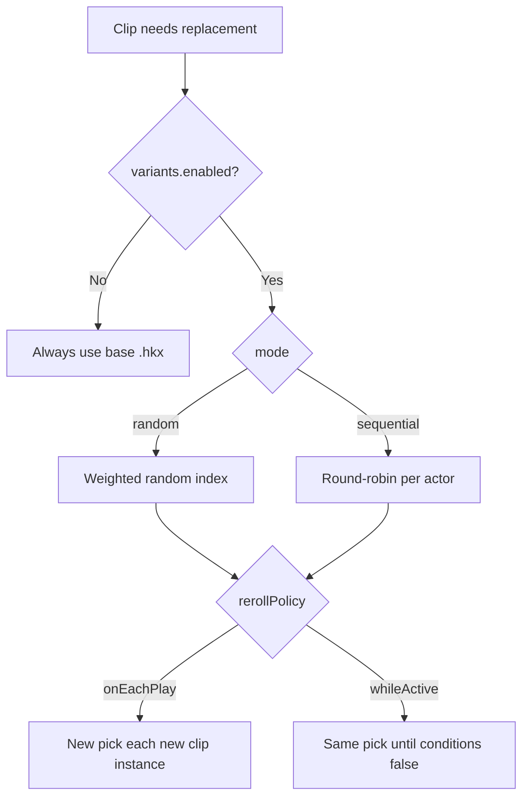
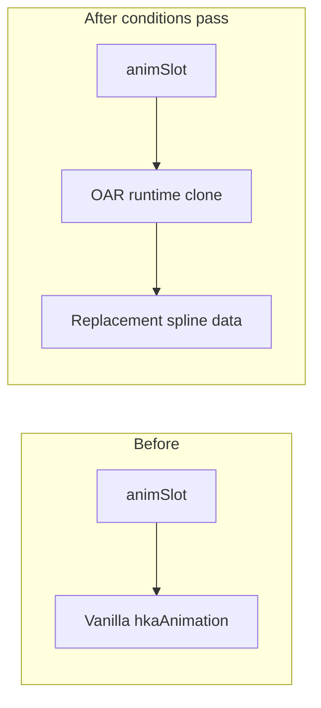
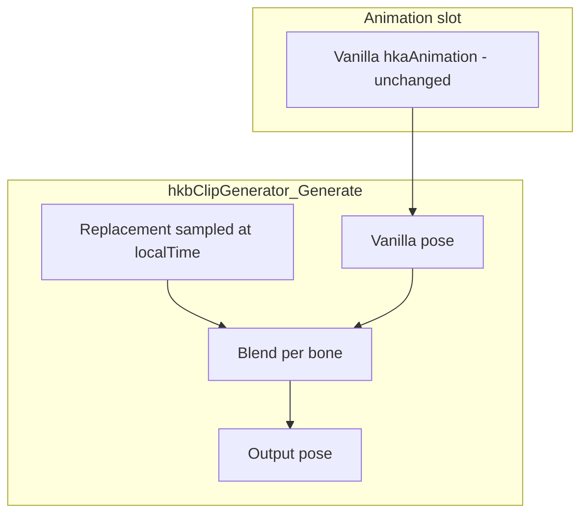

# Open Animation Replacer (Fallout 4)

[](https://github.com/DCCStudios/F4-OpenAnimationReplacer)

**Open Animation Replacer (OAR)** is an [F4SE](https://f4se.silverlock.org/) plugin that swaps Havok animation clips (`.hkx`) at runtime when configurable conditions are met. It is a Fallout 4 port of [Open Animation Replacer](https://github.com/Andrealphus-Mods/OpenAnimationReplacer) for Skyrim.

Use it to replace weapon reloads, idles, sprints, and other gameplay animations without editing the behavior graph, while still driving sounds and game events through Havok annotations.

---

## Table of contents

1. [Overview](#overview)
2. [How it works](#how-it-works)
3. [Installation](#installation)
4. [Content authoring](#content-authoring)
5. [Configuration reference](#configuration-reference)
6. [Variant animations](#variant-animations)
7. [Replacement modes](#replacement-modes)
8. [Conditions](#conditions)
9. [In-game UI](#in-game-ui)
10. [Project layout (developers)](#project-layout-developers)
11. [Building from source](#building-from-source)
12. [Troubleshooting](#troubleshooting)
13. [Documentation](#documentation)
14. [Credits](#credits)

---

## Overview

| Concept | Description |
|---------|-------------|
| **Replacer Mod** | Top-level pack folder under `OpenAnimationReplacer/` |
| **SubMod** | One logical replacement rule set (conditions + settings + `.hkx` files) |
| **Replacement animation** | A single target clip (e.g. `scar\wpnreload`) and its replacement file(s) |
| **Variant** | Multiple `.hkx` files grouped as `base`, `base_1`, `base_2`, … with random/sequential selection |
| **Cache suffix** | Internal key used to load and clone the correct `.hkx` (base or `__vN` synthetic suffix) |

OAR hooks `hkbClipGenerator` (Activate, Update, Deactivate, Generate) and optionally redirects file loads so the game’s animation database can resolve replacement paths.

---

## How it works

### High-level pipeline



### Data hierarchy


### Clip evaluation (one animation playing)

```mermaid
sequenceDiagram
    participant Game as Fallout 4 / Havok
    participant Clip as hkbClipGenerator
    participant OAR as OAR Update hook
    participant Cache as AnimationCache

    Game->>Clip: Activate (vanilla .hkx)
    Clip->>OAR: Update each frame
    OAR->>OAR: Match suffix e.g. scar\wpnreload
    OAR->>OAR: Pick highest-priority SubMod passing conditions
    alt Full-body replacement
        OAR->>Cache: GetOrBuildRuntimeAnim(suffix)
        Cache-->>OAR: Cloned hkaAnimation (patched duration/tracks)
        OAR->>Clip: *animSlot = replacement
    else Track filter
        OAR->>Cache: Register replacement for Generate
        Note over Clip: Original slot unchanged; bones blended in Generate
    end
    OAR->>OAR: Manual annotation firing if needed
    Game->>Clip: Deactivate
    OAR->>OAR: Cleanup maps, optional variant reset
```

---

## Installation

### End users

1. Install [F4SE](https://f4se.silverlock.org/) for your game version.
2. Place in `Fallout 4/Data/F4SE/Plugins/`:
   - `OpenAnimationReplacer.dll`
   - `OpenAnimationReplacer.ini` (optional; defaults apply if missing)
3. Install animation packs under `Data/Meshes/.../Animations/OpenAnimationReplacer/` (see [Content authoring](#content-authoring)).
4. Launch via `f4se_loader.exe`.

### Logs

| Log | Location |
|-----|----------|
| OAR plugin | `Documents/My Games/Fallout4/F4SE/OpenAnimationReplacer.log` |
| F4SE | `Documents/My Games/Fallout4/F4SE/f4se.log` |

---

## Content authoring

### Folder structure

OAR scans recursively for directories named **`OpenAnimationReplacer`**. Each **Replacer Mod** contains one or more **SubMods** (subfolders with `config.json` and `.hkx` files).

```
Data/Meshes/
└── Actors/
    └── Character/
        └── _1stPerson/                    ← note: _1stPerson not 1stPerson
            └── Animations/
                └── OpenAnimationReplacer/
                    └── SCAR OAR Test/              ← Replacer Mod
                        ├── config.json             ← optional mod metadata
                        └── SCAR Reload Test/       ← SubMod
                            ├── config.json         ← conditions, priority, variants, trackFilter
                            ├── user.json           ← optional user overrides (GUI-written)
                            └── SCAR/
                                ├── WPNReload.hkx
                                ├── WPNReload_1.hkx
                                ├── WPNReload_2.hkx
                                └── WPNReload_3.hkx
```

**Path rule:** A file in the SubMod must mirror the **relative animation path** it replaces.  
Example: `SCAR/WPNReload.hkx` in the SubMod replaces  
`Meshes/Actors/Character/_1stPerson/Animations/SCAR/WPNReload.hkx`.

### Mod-level `config.json` (optional)

```json
{
  "name": "SCAR OAR Test",
  "author": "YourName",
  "description": "Custom SCAR reload and idle animations."
}
```

### SubMod `config.json` (core behavior)

```json
{
  "name": "SCAR Reload Test",
  "description": "Reload when magazine not empty.",
  "priority": 1000,
  "disabled": false,
  "interruptible": true,
  "replaceOnLoop": true,
  "replaceOnEcho": true,
  "replaceAnnotations": true,
  "conditions": [
    {
      "condition": "IsForm",
      "Form": { "pluginName": "Fallout4.esm", "formID": "0x14" }
    },
    {
      "condition": "CurrentMagazineAmmo",
      "comparison": 1,
      "numericValue": { "type": "Static", "value": 0.0 }
    },
    { "condition": "IsEquipped", "Form": { "pluginName": "SCAR-H.esp", "formID": "0x2E1F" } }
  ],
  "variants": {
    "enabled": true,
    "mode": "random",
    "rerollPolicy": "onEachPlay",
    "weights": {
      "WPNReload_1.hkx": 1.0,
      "WPNReload_2.hkx": 2.0,
      "WPNReload_3.hkx": 1.0
    }
  },
  "trackFilter": {
    "enabled": false,
    "mode": "override",
    "weight": 1.0,
    "blendInTime": 0.15,
    "blendOutTime": 0.15,
    "boneNames": ["LArm_Collarbone", "RArm_Collarbone"],
    "excludeBoneNames": []
  },
  "eventsOnStart": [],
  "eventsOnEnd": ["ReloadComplete"]
}
```

### SubMod fields (summary)

| Field | Type | Default | Description |
|-------|------|---------|-------------|
| `name` | string | folder name | Display name in UI |
| `priority` | int | 0 | Higher value wins when multiple SubMods match |
| `disabled` | bool | false | Skip entirely |
| `interruptible` | bool | false | Re-evaluate conditions every frame |
| `replaceOnLoop` | bool | true | Re-evaluate when clip loops |
| `replaceOnEcho` | bool | true | Re-evaluate on echo / blend |
| `replaceAnnotations` | bool | true | Use replacement annotations (may null triggers + manual fire) |
| `playOnceFullBody` | bool | false | Keep vanilla triggers until anim completes (state machine exit) |
| `deactivationDelay` | float | 0 | Seconds to hold replacement after conditions fail |
| `conditions` | array | `[]` | AND list; empty = always match |
| `variants` | object | — | Variant selection settings (see below) |
| `trackFilter` | object | disabled | Partial-body bone override |
| `eventsOnStart` / `eventsOnEnd` | string[] | `[]` | Custom behavior graph events |

### User overrides (`user.json`)

Players can override author settings without editing `config.json`. The in-game UI writes `user.json` in the same SubMod folder; any field present overrides the author file.

```json
{
  "disabled": false,
  "priority": 500,
  "variants": { "enabled": true, "mode": "sequential" }
}
```

---

## Configuration reference

### Plugin INI — `Data/F4SE/Plugins/OpenAnimationReplacer.ini`

| Section | Key | Default | Description |
|---------|-----|---------|-------------|
| **General** | `bEnabled` | `1` | Master enable |
| | `bEnableUI` | `1` | ImGui overlay |
| | `bAsyncParsing` | `1` | Background parse at load |
| | `bDisablePreloading` | `0` | Skip upfront `.hkx` preload |
| | `bFilterOutDuplicateAnimations` | `1` | Dedupe registration |
| **UI** | `iToggleKey` | `24` (`0x18`) | DIK scan code for UI toggle |
| | `bRequireShift` | `1` | Require Shift + toggle key |
| **AnimationLog** | `bLogReplace` | `1` | Log replacements in overlay |
| | `iMaxLogEntries` | `100` | Log buffer size |
| **Limits** | `iAnimationLimit` | `16384` | Max registered replacements |
| | `iHavokHeapMultiplier` | `2` | Havok heap scaling hint |
| **Debug** | `bVerboseLogging` | `0` | Extra plugin logging |

---

## Variant animations

Variants let one replacement target (`wpnreload`) draw from several `.hkx` files with different motion, length, and annotations.

### File naming convention

| File | Role |
|------|------|
| `WPNReload.hkx` | Base animation (always included as variant index 0) |
| `WPNReload_1.hkx` | Variant 1 (`_` + digits after stem) |
| `WPNReload_2.hkx` | Variant 2 |
| `WPNReload_10.hkx` | Variant 10 |

**Requirements:**

- A **base** file (no `_N` suffix) must exist for `_N` files to be grouped as variants.
- Orphan `_N` files without a base are registered as standalone replacements.

### Internal cache keys

At parse time, variants receive synthetic cache suffixes so each file loads independently:

| Disk file | Cache suffix (example) |
|-----------|-------------------------|
| `scar\wpnreload.hkx` | `scar\wpnreload` |
| `scar\wpnreload_1.hkx` | `scar\wpnreload__v1` |
| `scar\wpnreload_2.hkx` | `scar\wpnreload__v2` |

### Selection modes



| `variants.mode` | Behavior |
|-----------------|----------|
| `random` | Weighted roll; optional `weights` per filename |
| `sequential` | Cycles 0 → 1 → 2 → … per actor |

| `variants.rerollPolicy` | Behavior |
|-------------------------|----------|
| `onEachPlay` | New selection when a **new** clip generator starts (each reload press) |
| `whileActive` | Same selection while SubMod conditions stay true |

| UI / future JSON | `shareRandomResults` | All actors share one roll (random mode only) |

### JSON example

```json
"variants": {
  "enabled": true,
  "mode": "random",
  "rerollPolicy": "onEachPlay",
  "weights": {
    "WPNReload_1.hkx": 1.0,
    "WPNReload_2.hkx": 3.0
  }
}
```

### Duration and annotations

Each variant loads its own `.hkx` into `AnimationCache` with its own **duration**, **tracks**, and **annotations**. Full-body replacement patches the cloned `hkaAnimation` duration so the engine loops at the replacement length. Annotation events (reload stages, sounds) are fired manually from the replacement clip’s annotation list.

---

## Replacement modes

### Full-body replacement (default)



- Swaps the pointer at `animationControl → binding → animation`.
- Replacement **duration** and spline metadata are patched on the clone.
- Best for complete reload / idle / locomotion overrides.

**Caveat:** Hardcoded behavior graph **transitions** (e.g. “exit reload at 2.5s”) still follow the `.hkb` graph, not your clip length. Use `playOnceFullBody` or `eventsOnEnd` where needed.

### Partial-body (track filter)



- Does **not** swap `animSlot`; samples the replacement per filtered bone.
- `trackFilter.boneNames` — bones to override or additively blend.
- `blendInTime` / `blendOutTime` — alpha ramp when conditions toggle.
- `localTime` is wrapped to the replacement duration when sampling (different-length clips).

| `trackFilter.mode` | Effect |
|--------------------|--------|
| `override` | Replace bone transform with replacement |
| `additive` | Add replacement on top of base pose |

---

## Conditions

SubMod conditions use **AND** logic at the root. Use `OR` / `AND` / `XOR` nodes and `negated` for complex logic.

**Evaluation order:** All SubMods matching the clip suffix are sorted by **priority (descending)**; the first whose condition set passes wins.

### Condition categories (registered types)

| Category | Examples |
|----------|----------|
| **Actor / combat** | `IsWeaponDrawn`, `IsInCombat`, `IsSprinting`, `IsADS`, `IsReloading`, `IsFiring`, `IsAttacking`, `IsBlocking` |
| **Movement** | `IsInAir`, `IsSneaking`, `IsRunning`, `IsSwimming`, `IsMovementDirection`, `MovementSpeed` |
| **Forms** | `IsForm`, `IsActorBase`, `IsEquipped`, `IsEquippedType`, `IsEquippedHasKeyword`, `HasKeyword` |
| **Ammo / equipment** | `CurrentMagazineAmmo`, `InventoryCount`, `IsWorn`, `IsWornHasKeyword` |
| **World** | `IsWorldSpace`, `IsParentCell`, `IsInLocation`, `IsInInterior`, `CurrentWeather`, `LightLevel` |
| **Animation** | `IsPlayingIdleAnimation`, `AnimProgress`, `AnimTimeElapsed`, `AnimTimeRemaining` |
| **Logic** | `OR`, `AND`, `XOR`, `Random`, `TARGET`, `PLAYER` |
| **Comparison** | `Level`, `CompareActorValue`, `Scale`, `FactionRank`, … |

Full parameter reference: **[docs/QuickStart.md](docs/QuickStart.md)**.

### Example: reload when magazine not empty

```json
{
  "condition": "CurrentMagazineAmmo",
  "comparison": 1,
  "numericValue": { "type": "Static", "value": 0.0 }
}
```

`comparison: 1` = Not Equal → passes when ammo **≠** 0.

### Example: only while a specific idle plays

```json
{
  "condition": "IsPlayingIdleAnimation",
  "Form": { "pluginName": "SomeMod.esp", "formID": "0x12345" }
}
```

---

## In-game UI

| Input | Action |
|-------|--------|
| **Shift + O** (default) | Toggle main overlay (`iToggleKey=0x18`, `bRequireShift=1`) |

### Modes

| Mode | Capabilities |
|------|----------------|
| **Inspect** | View mods, conditions, live pass/fail |
| **User** | Enable/disable SubMods, priorities → saves `user.json` |
| **Author** | Edit conditions, variants, track filter → saves `config.json` |

### Windows

- **Replacer tree** — mods → submods → replacement list (variant count shown).
- **Condition editor** — add/remove/negate; form pickers for idle/weapon records.
- **Variant settings** — enable, random/sequential, reroll policy, weight sliders.
- **Active Replacements** — debug view of current swaps (includes variant suffix).
- **Animation Log** — real-time activate/replace/loop events.

---

## Project layout (developers)

```
OpenAnimationReplacer/
├── CMakeLists.txt          # Build + CommonLibF4 link
├── CMakePresets.json       # msvc-release / msvc-debug
├── OpenAnimationReplacer.ini
├── README.md
├── docs/
│   ├── QuickStart.md       # Authoring + conditions (detailed)
│   ├── HavokReference.md
│   └── HavokReference2.md
├── src/
│   ├── main.cpp            # F4SE entry, messaging
│   ├── Hooks.cpp           # hkbClipGenerator hooks, track filter, variants
│   ├── Parsing.cpp         # Disk scan, variant grouping, JSON
│   ├── AnimationCache.cpp  # .hkx load, runtime clone, annotations
│   ├── Variants.cpp        # Random/sequential selection
│   ├── Conditions.cpp      # Condition implementations
│   ├── ReplacerMods.h      # SubMod, TrackFilter, variant settings
│   ├── OpenAnimationReplacer.cpp  # Path map, DB injection
│   └── UI/                 # ImGui (UIManager, UIMain, debug overlay)
└── Compile/F4SE/Plugins/   # Build output (OpenAnimationReplacer.dll)
```

### Key runtime components

| Component | Responsibility |
|-----------|----------------|
| `Parsing` | Discover `.hkx`, group variants, read JSON |
| `OpenAnimationReplacer` | `animPathToReplacementsMap`, bundle injection |
| `AnimationCache` | Load packfile/tagfile, build runtime clones |
| `Hooks` | Condition eval, swap or track-filter, annotation firing |
| `Variants` | Per-actor / per-clip selection state |
| `ActiveReplacementTracker` | Debug overlay entries |

---

## Building from source

### Prerequisites

| Tool | Notes |
|------|-------|
| **Visual Studio 2022** | x64, Desktop development with C++ |
| **CMake** | ≥ 3.21 |
| **vcpkg** | `VCPKG_ROOT` set; triplet `x64-windows-static-md` |
| **CommonLibF4** | Expected at `../PluginTemplate/CommonLibF4` (adjust `CMakeLists.txt` if needed) |
| **Fallout4Path** | Environment variable → game root |

### Commands

```powershell
cd OpenAnimationReplacer
cmake --preset msvc-release
cmake --build build/release --config Release
```

**Output:** `Compile/F4SE/Plugins/OpenAnimationReplacer.dll`

Copy the DLL and `OpenAnimationReplacer.ini` to `Data/F4SE/Plugins/`.

### vcpkg manifest

Dependencies are declared in `vcpkg.json` (e.g. `spdlog`, `nlohmann-json`, `imgui`).

---

## Troubleshooting

| Symptom | Things to check |
|---------|------------------|
| **No replacement in game** | `bEnabled=1`; conditions in log (`OpenAnimationReplacer.log`); priority vs other SubMods; correct `_1stPerson` path |
| **Only one variant plays** | `variants.enabled`; `rerollPolicy`; ensure multiple `_N` files + base exist |
| **Reload anim cancels mid-play** | Often interruptible SubMod or competing priority; check transition logs |
| **Ammo updates but no visible anim** | Conditions pass but clip swap failed — check cache load errors in log |
| **No sound / reload events** | `replaceAnnotations`; annotation times in replacement `.hkx`; `eventsOnEnd` |
| **Crash at startup in ReadBoundAnimDataBinary** | Usually corrupt/unrelated `.hkx` in load order — not OAR hook code; test without animation packs |
| **Track filter looks wrong** | Bone names must match skeleton; try `override` vs `additive`; check blend times |

Enable `bVerboseLogging=1` and inspect `[OAR-Transition]`, `[OAR-Variant]`, `[OAR-Cache]` lines.

---

## Documentation

| Document | Contents |
|----------|----------|
| [docs/QuickStart.md](docs/QuickStart.md) | Step-by-step authoring, full condition list, examples |
| [docs/HavokReference.md](docs/HavokReference.md) | Struct offsets and Havok notes |
| [docs/HavokReference2.md](docs/HavokReference2.md) | Additional Havok / clip generator notes |

Parent workspace (if present): `F4SE_Plugin_Development_Reference.md` for F4SE plugin conventions.

---

## Credits

- **Original Skyrim mod:** [Open Animation Replacer](https://github.com/Andrealphus-Mods/OpenAnimationReplacer) — Andrealphus-Mods
- **Fallout 4 port:** [DCC Studios](https://github.com/DCCStudios/F4-OpenAnimationReplacer) / contributors
- **CommonLibF4:** Ryan-rsm-McKenzie and contributors

---

## License

See repository license when published. The Skyrim original remains under its upstream license.
