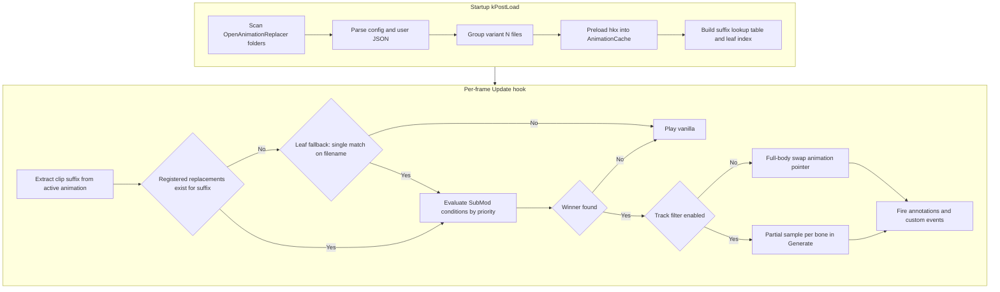
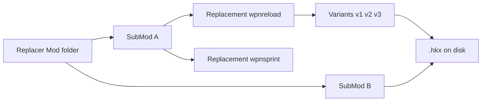
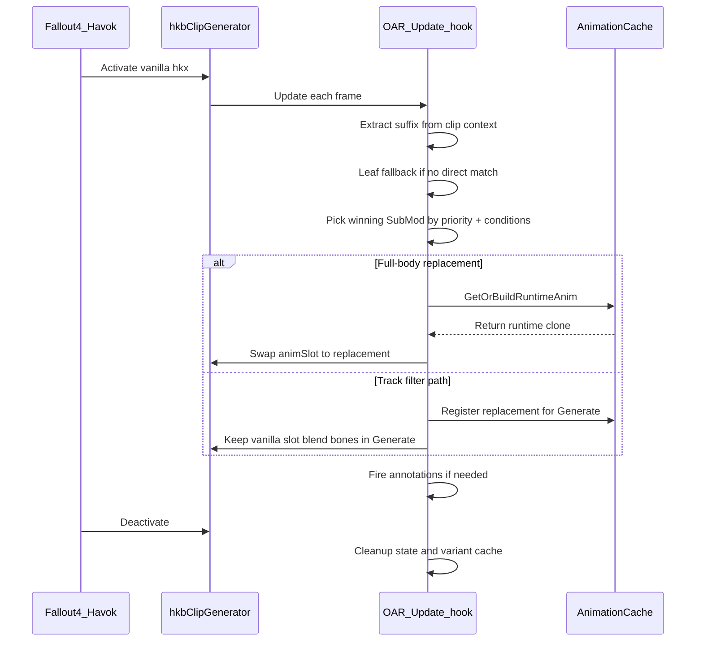
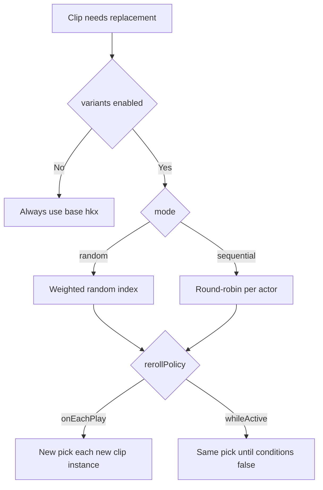
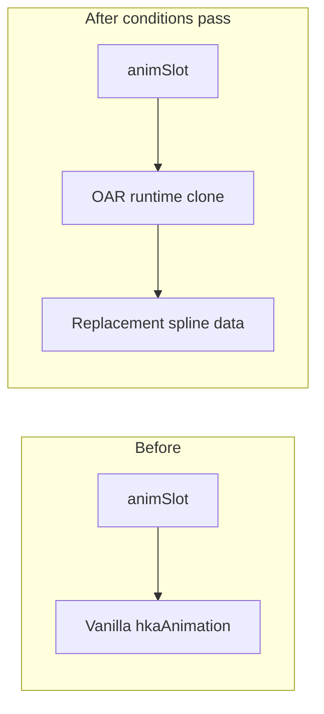
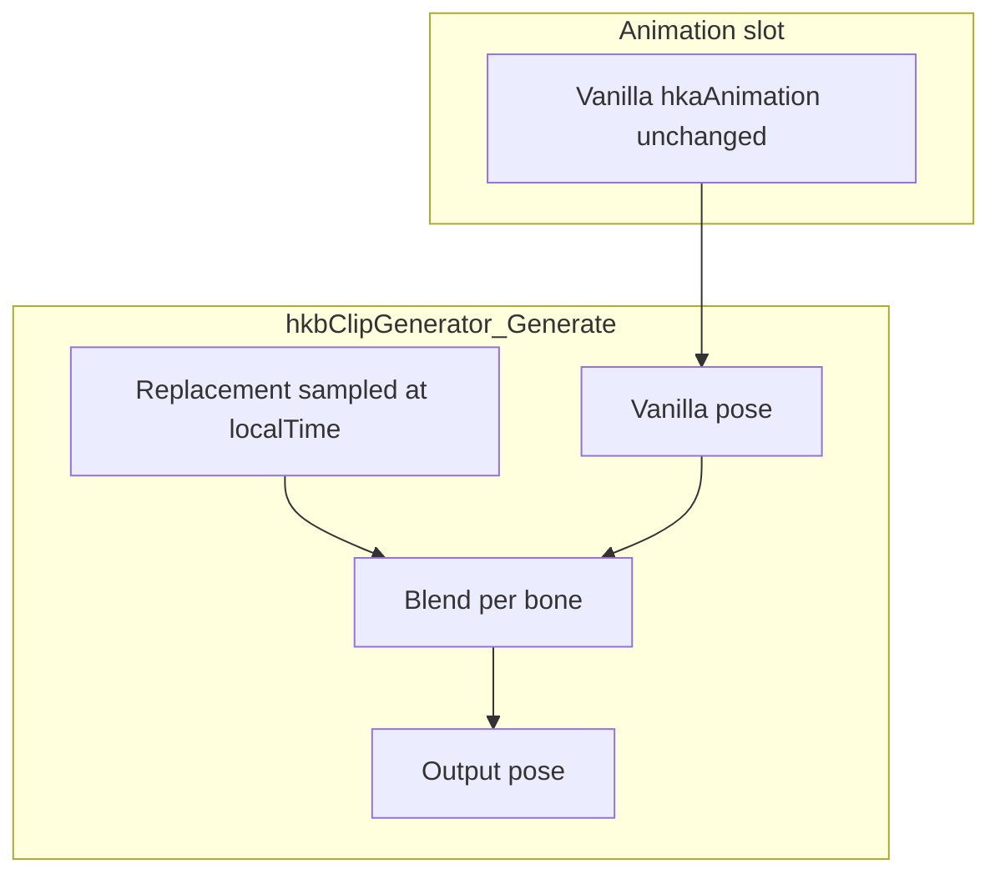
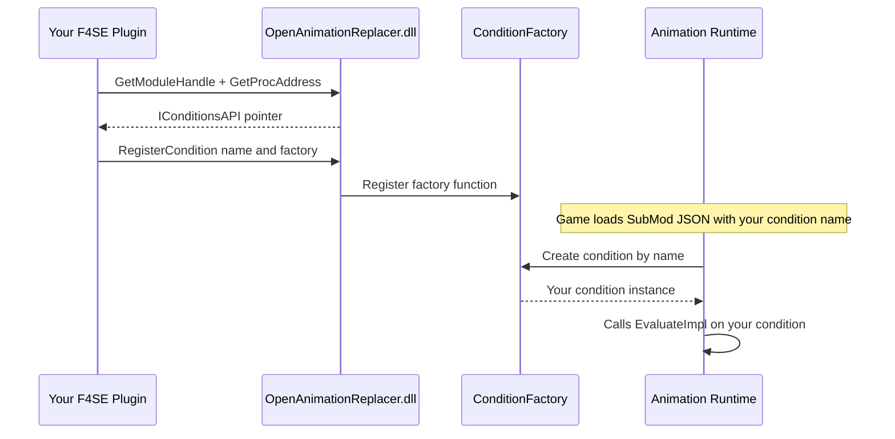

# Open Animation Replacer (Fallout 4)

[](https://github.com/DCCStudios/F4-OpenAnimationReplacer)

**Open Animation Replacer (OAR)** is an [F4SE](https://f4se.silverlock.org/) plugin that swaps Havok animation clips (`.hkx`) at runtime when configurable conditions are met. It is a Fallout 4 port of [Open Animation Replacer](https://github.com/Andrealphus-Mods/OpenAnimationReplacer) for Skyrim.

Use it to replace weapon reloads, idles, sprints, and other gameplay animations without editing the behavior graph, while still driving sounds and game events through Havok annotations.

---

## Table of contents

1. [Overview](#overview)
2. [How it works](#how-it-works)
3. [Installation](#installation)
4. [Content authoring](#content-authoring)
5. [Configuration reference](#configuration-reference)
6. [Variant animations](#variant-animations)
7. [Replacement modes](#replacement-modes)
8. [Conditions](#conditions)
9. [In-game UI](#in-game-ui)
10. [Plugin API (for developers)](#plugin-api-for-developers)
11. [Project layout (developers)](#project-layout-developers)
12. [Building from source](#building-from-source)
13. [Troubleshooting](#troubleshooting)
14. [Documentation](#documentation)
15. [Credits](#credits)

---

## Overview

| Concept | Description |
|---------|-------------|
| **Replacer Mod** | Top-level pack folder under `OpenAnimationReplacer/` |
| **SubMod** | One logical replacement rule set (conditions + settings + `.hkx` files) |
| **Replacement animation** | A `.hkx` file that replaces a vanilla animation when conditions pass |
| **Suffix** | Internal matching key -- the part of an animation path after `Animations\` minus the extension (e.g. `scar\wpnreload`). OAR matches replacements to playing clips by suffix. |
| **Leaf fallback** | When no exact suffix match exists, OAR matches on filename alone (e.g. `wpnreload`). Conditions disambiguate if multiple replacements share a leaf. |
| **Variant** | Multiple `.hkx` files grouped as `base`, `base_1`, `base_2`, ... with random/sequential selection |
| **Conditions** | AND-logic rules that determine WHEN a SubMod's replacement should activate (e.g. specific weapon equipped, specific actor, in combat) |
| **Priority** | Integer value -- when multiple SubMods match the same animation, highest priority wins |

OAR hooks `hkbClipGenerator` (Activate, Update, Deactivate, Generate) and optionally redirects file loads so the game's animation database can resolve replacement paths.

---

## How it works

### High-level pipeline



### Matching mechanism

OAR uses a **suffix-based matching** system with a **leaf fallback**:

1. **Suffix extraction:** From each registered `.hkx`, OAR computes a suffix by taking the path after `Animations\` and stripping the extension. Example: `scar\wpnreload`.

2. **Runtime resolution:** When a clip plays, OAR extracts the same kind of suffix from the active animation using multiple sources (weapon graph path, behavior string data, idle anim data, animationName field).

3. **Leaf fallback:** If the full suffix (e.g. `44pistol\wpnreload`) has no registered replacement, OAR falls back to just the filename/leaf (e.g. `wpnreload`). If exactly one replacement is registered for that leaf, it matches. If multiple share it, all are evaluated via conditions.

4. **Condition evaluation:** Among candidates, SubMods are tried in priority order (highest first). The first whose conditions all pass wins.

### Data hierarchy



### Clip evaluation (one animation playing)



---

## Installation

### End users

1. Install [F4SE](https://f4se.silverlock.org/) for your game version.
2. Place in `Fallout 4/Data/F4SE/Plugins/`:
   - `OpenAnimationReplacer.dll`
   - `OpenAnimationReplacer.ini` (optional; defaults apply if missing)
3. Install animation packs under `Data/Meshes/.../Animations/OpenAnimationReplacer/` (see [Content authoring](#content-authoring)).
4. Launch via `f4se_loader.exe`.

### Logs

| Log | Location |
|-----|----------|
| OAR plugin | `Documents/My Games/Fallout4/F4SE/OpenAnimationReplacer.log` |
| F4SE | `Documents/My Games/Fallout4/F4SE/f4se.log` |

---

## Content authoring

### How animation matching works

OAR does **not** require you to replicate the full vanilla folder structure. Matching is based on the **animation filename** (the "leaf name") combined with **conditions** -- not on mirroring exact directory paths.

At startup, OAR extracts a **suffix** from each `.hkx` file you provide. At runtime, it extracts the same kind of suffix from the animation the game is currently playing and looks for a match. The matching uses a **leaf fallback**: if multiple replacements share the same filename, conditions and priority determine which one wins.

**In practice this means:**

1. Your `.hkx` filename must match the animation filename the game uses (e.g. `WPNReload.hkx` to replace a reload animation named `WPNReload.hkx`).
2. **Conditions** are the primary mechanism for targeting -- use them to specify which weapon, actor, or game state triggers your replacement.
3. Folder structure within your SubMod is optional and only provides disambiguation when multiple mods target the same filename. If your filename is unique across all installed OAR mods, folders don't matter.
4. **Priority** (integer in `config.json`) resolves conflicts when multiple SubMods match the same clip -- highest value wins.

### Folder structure

OAR scans recursively under `Data/Meshes/` for directories named **`OpenAnimationReplacer`**. Each immediate subfolder is a **Replacer Mod**, and each subfolder within that is a **SubMod**.

```
Data/Meshes/
+-- Actors/
    +-- Character/
        +-- _1stPerson/                    <-- note: _1stPerson not 1stPerson
            +-- Animations/
                +-- OpenAnimationReplacer/
                    +-- SCAR OAR Test/              <-- Replacer Mod
                        |-- config.json             <-- optional mod metadata
                        +-- SCAR Reload Test/       <-- SubMod
                            |-- config.json         <-- conditions, priority, variants, trackFilter
                            |-- user.json           <-- optional user overrides (GUI-written)
                            |-- WPNReload.hkx       <-- flat layout works fine
                            |-- WPNReload_1.hkx
                            |-- WPNReload_2.hkx
                            +-- WPNReload_3.hkx
```

You can also organize files into subfolders within the SubMod for clarity or disambiguation:

```
+-- SCAR Reload Test/
    |-- config.json
    +-- SCAR/                <-- optional subfolder for disambiguation
        |-- WPNReload.hkx
        +-- WPNReload_1.hkx
```

When a subfolder is used, the matching suffix becomes `scar\wpnreload` instead of just `wpnreload`. This is useful when multiple weapons share the same animation filename and you need OAR to distinguish them.

### Matching rules summary

| Scenario | What happens |
|----------|-------------|
| Your file is `WPNReload.hkx` and only one SubMod targets that name | Matches via leaf fallback -- no subfolder needed |
| Multiple SubMods all have `WPNReload.hkx` | All are evaluated; **conditions + priority** determine the winner |
| You put your file under `SCAR/WPNReload.hkx` | Suffix becomes `scar\wpnreload` -- only matches clips whose full path contains that |
| Conditions are empty (`"conditions": []`) | SubMod always matches (acts as a universal default for that animation) |

### Step-by-step setup guide

1. **Identify the animation to replace.** Enable `bVerboseLogging=1` in `OpenAnimationReplacer.ini`, then perform the action in-game. Check the log for `[OAR-Suffix]` lines -- the suffix shown is what OAR will try to match against.

2. **Name your `.hkx` file to match.** The filename must correspond to the leaf part of the suffix from step 1. For example, if the log shows suffix `scar\wpnreload`, your file should be named `WPNReload.hkx` (case-insensitive).

3. **Create the folder structure:**
   ```
   Data/Meshes/Actors/Character/_1stPerson/Animations/OpenAnimationReplacer/
   +-- Your Mod Name/           <-- Replacer Mod (any name)
       +-- Your SubMod Name/    <-- SubMod (any name, or a number for default priority)
           |-- config.json      <-- conditions + settings
           +-- WPNReload.hkx    <-- your replacement animation
   ```

4. **Write conditions in `config.json`** to target the specific situation (weapon, actor state, etc.). Without conditions, the SubMod will replace that animation for everyone always.

5. **(Optional) Add variants** by placing additional files with `_N` suffixes: `WPNReload_1.hkx`, `WPNReload_2.hkx`, etc. A base file without a suffix must also exist for variants to be grouped.

6. **Set priority** if other OAR mods might also target the same animation. Higher priority wins.

### Path placement (where under Meshes)

The `OpenAnimationReplacer/` folder must be placed somewhere within the scan paths. OAR scans:

- `Data/Meshes/Actors/<race>/Animations/` (3rd-person animations)
- `Data/Meshes/Actors/<race>/_1stPerson/` (1st-person animations)
- `Data/Meshes/Actors/<race>/Character/Animations/` (fallback path)
- Full `Data/Meshes/` recursive scan as a last resort (if nothing found in targeted paths)

For first-person weapon animations, the standard placement is:
```
Data/Meshes/Actors/Character/_1stPerson/Animations/OpenAnimationReplacer/
```

### Mod-level `config.json` (optional)

```json
{
  "name": "SCAR OAR Test",
  "author": "YourName",
  "description": "Custom SCAR reload and idle animations."
}
```

### SubMod `config.json` (core behavior)

```json
{
  "name": "SCAR Reload Test",
  "description": "Reload when magazine not empty.",
  "priority": 1000,
  "disabled": false,
  "interruptible": true,
  "replaceOnLoop": true,
  "replaceOnEcho": true,
  "replaceAnnotations": true,
  "conditions": [
    {
      "condition": "IsForm",
      "Form": { "pluginName": "Fallout4.esm", "formID": "0x14" }
    },
    {
      "condition": "CurrentMagazineAmmo",
      "comparison": 1,
      "numericValue": { "type": "Static", "value": 0.0 }
    },
    { "condition": "IsEquipped", "Form": { "pluginName": "SCAR-H.esp", "formID": "0x2E1F" } }
  ],
  "variants": {
    "enabled": true,
    "mode": "random",
    "rerollPolicy": "onEachPlay",
    "weights": {
      "WPNReload_1.hkx": 1.0,
      "WPNReload_2.hkx": 2.0,
      "WPNReload_3.hkx": 1.0
    }
  },
  "trackFilter": {
    "enabled": false,
    "mode": "override",
    "weight": 1.0,
    "blendInTime": 0.15,
    "blendOutTime": 0.15,
    "boneNames": ["LArm_Collarbone", "RArm_Collarbone"],
    "excludeBoneNames": []
  },
  "eventsOnStart": [],
  "eventsOnEnd": ["ReloadComplete"]
}
```

### SubMod fields (summary)

| Field | Type | Default | Description |
|-------|------|---------|-------------|
| `name` | string | folder name | Display name in UI |
| `priority` | int | 0 | Higher value wins when multiple SubMods match |
| `disabled` | bool | false | Skip entirely |
| `interruptible` | bool | false | Re-evaluate conditions every frame |
| `replaceOnLoop` | bool | true | Re-evaluate when clip loops |
| `replaceOnEcho` | bool | true | Re-evaluate on echo / blend |
| `replaceAnnotations` | bool | true | Use replacement annotations (may null triggers + manual fire) |
| `playOnceFullBody` | bool | false | Keep vanilla triggers until anim completes (state machine exit) |
| `deactivationDelay` | float | 0 | Seconds to hold replacement after conditions fail |
| `conditions` | array | `[]` | AND list; empty = always match |
| `variants` | object | -- | Variant selection settings (see below) |
| `trackFilter` | object | disabled | Partial-body bone override |
| `eventsOnStart` / `eventsOnEnd` | string[] | `[]` | Custom behavior graph events |

### User overrides (`user.json`)

Players can override author settings without editing `config.json`. The in-game UI writes `user.json` in the same SubMod folder; any field present overrides the author file.

```json
{
  "disabled": false,
  "priority": 500,
  "variants": { "enabled": true, "mode": "sequential" }
}
```

---

## Configuration reference

### Plugin INI -- `Data/F4SE/Plugins/OpenAnimationReplacer.ini`

| Section | Key | Default | Description |
|---------|-----|---------|-------------|
| **General** | `bEnabled` | `1` | Master enable |
| | `bEnableUI` | `1` | ImGui overlay |
| | `bAsyncParsing` | `1` | Background parse at load |
| | `bDisablePreloading` | `0` | Skip upfront `.hkx` preload |
| | `bFilterOutDuplicateAnimations` | `1` | Dedupe registration |
| **UI** | `iToggleKey` | `24` (`0x18`) | DIK scan code for UI toggle |
| | `bRequireShift` | `1` | Require Shift + toggle key |
| **AnimationLog** | `bLogReplace` | `1` | Log replacements in overlay |
| | `iMaxLogEntries` | `100` | Log buffer size |
| **Limits** | `iAnimationLimit` | `16384` | Max registered replacements |
| | `iHavokHeapMultiplier` | `2` | Havok heap scaling hint |
| **Debug** | `bVerboseLogging` | `0` | Extra plugin logging |

---

## Variant animations

Variants let one replacement target (`wpnreload`) draw from several `.hkx` files with different motion, length, and annotations.

### File naming convention

| File | Role |
|------|------|
| `WPNReload.hkx` | Base animation (always included as variant index 0) |
| `WPNReload_1.hkx` | Variant 1 (`_` + digits after stem) |
| `WPNReload_2.hkx` | Variant 2 |
| `WPNReload_10.hkx` | Variant 10 |

**Requirements:**

- A **base** file (no `_N` suffix) must exist for `_N` files to be grouped as variants.
- Orphan `_N` files without a base are registered as standalone replacements.

### Internal cache keys

At parse time, variants receive synthetic cache suffixes so each file loads independently:

| Disk file | Cache suffix (example) |
|-----------|-------------------------|
| `scar\wpnreload.hkx` | `scar\wpnreload` |
| `scar\wpnreload_1.hkx` | `scar\wpnreload__v1` |
| `scar\wpnreload_2.hkx` | `scar\wpnreload__v2` |

### Selection modes



| `variants.mode` | Behavior |
|-----------------|----------|
| `random` | Weighted roll; optional `weights` per filename |
| `sequential` | Cycles 0, 1, 2, ... per actor |

| `variants.rerollPolicy` | Behavior |
|-------------------------|----------|
| `onEachPlay` | New selection when a **new** clip generator starts (each reload press) |
| `whileActive` | Same selection while SubMod conditions stay true |

| UI / future JSON | `shareRandomResults` | All actors share one roll (random mode only) |

### JSON example

```json
"variants": {
  "enabled": true,
  "mode": "random",
  "rerollPolicy": "onEachPlay",
  "weights": {
    "WPNReload_1.hkx": 1.0,
    "WPNReload_2.hkx": 3.0
  }
}
```

### Duration and annotations

Each variant loads its own `.hkx` into `AnimationCache` with its own **duration**, **tracks**, and **annotations**. Full-body replacement patches the cloned `hkaAnimation` duration so the engine loops at the replacement length. Annotation events (reload stages, sounds) are fired manually from the replacement clip's annotation list.

---

## Replacement modes

### Full-body replacement (default)



- Swaps the pointer at `animationControl -> binding -> animation`.
- Replacement **duration** and spline metadata are patched on the clone.
- Best for complete reload / idle / locomotion overrides.

**Caveat:** Hardcoded behavior graph **transitions** (e.g. "exit reload at 2.5s") still follow the `.hkb` graph, not your clip length. Use `playOnceFullBody` or `eventsOnEnd` where needed.

### Partial-body (track filter)



- Does **not** swap `animSlot`; samples the replacement per filtered bone.
- `trackFilter.boneNames` -- bones to override or additively blend.
- `blendInTime` / `blendOutTime` -- alpha ramp when conditions toggle.
- `localTime` is wrapped to the replacement duration when sampling (different-length clips).

| `trackFilter.mode` | Effect |
|--------------------|--------|
| `override` | Replace bone transform with replacement |
| `additive` | Add replacement on top of base pose |

---

## Conditions

SubMod conditions use **AND** logic at the root. Use `OR` / `AND` / `XOR` nodes and `negated` for complex logic.

**Evaluation order:** All SubMods matching the clip suffix are sorted by **priority (descending)**; the first whose condition set passes wins.

### Condition categories (registered types)

| Category | Examples |
|----------|----------|
| **Actor / combat** | `IsWeaponDrawn`, `IsInCombat`, `IsSprinting`, `IsADS`, `IsReloading`, `IsFiring`, `IsAttacking`, `IsBlocking` |
| **Movement** | `IsInAir`, `IsSneaking`, `IsRunning`, `IsSwimming`, `IsMovementDirection`, `MovementSpeed` |
| **Forms** | `IsForm`, `IsActorBase`, `IsEquipped`, `IsEquippedType`, `IsEquippedHasKeyword`, `HasKeyword` |
| **Ammo / equipment** | `CurrentMagazineAmmo`, `InventoryCount`, `IsWorn`, `IsWornHasKeyword` |
| **World** | `IsWorldSpace`, `IsParentCell`, `IsInLocation`, `IsInInterior`, `CurrentWeather`, `LightLevel` |
| **Animation** | `IsPlayingIdleAnimation`, `AnimProgress`, `AnimTimeElapsed`, `AnimTimeRemaining` |
| **Logic** | `OR`, `AND`, `XOR`, `Random`, `TARGET`, `PLAYER` |
| **Comparison** | `Level`, `CompareActorValue`, `Scale`, `FactionRank`, etc. |

Full parameter reference: **[docs/QuickStart.md](docs/QuickStart.md)**.

### Example: reload when magazine not empty

```json
{
  "condition": "CurrentMagazineAmmo",
  "comparison": 1,
  "numericValue": { "type": "Static", "value": 0.0 }
}
```

`comparison: 1` = Not Equal -- passes when ammo is not 0.

### Example: only while a specific idle plays

```json
{
  "condition": "IsPlayingIdleAnimation",
  "Form": { "pluginName": "SomeMod.esp", "formID": "0x12345" }
}
```

---

## In-game UI

| Input | Action |
|-------|--------|
| **Shift + O** (default) | Toggle main overlay (`iToggleKey=0x18`, `bRequireShift=1`) |

### Modes

| Mode | Capabilities |
|------|----------------|
| **Inspect** | View mods, conditions, live pass/fail |
| **User** | Enable/disable SubMods, priorities -- saves `user.json` |
| **Author** | Edit conditions, variants, track filter -- saves `config.json` |

### Windows

- **Replacer tree** -- mods, submods, replacement list (variant count shown).
- **Condition editor** -- add/remove/negate; form pickers for idle/weapon records.
- **Variant settings** -- enable, random/sequential, reroll policy, weight sliders.
- **Active Replacements** -- debug view of current swaps (includes variant suffix).
- **Animation Log** -- real-time activate/replace/loop events.

---

## Plugin API (for developers)

OAR exposes a C++ API that allows other F4SE plugins to register custom condition types at runtime. This means you can add entirely new conditions without modifying OAR's source code.

### Architecture



### Quick Start

1. **Copy two SDK headers** into your project (from OAR's `src/API/` folder):
   - `OpenAnimationReplacerAPI-Conditions.h` — API interface + `GetAPI()` helper
   - `OpenAnimationReplacer-ConditionTypes.h` — `ConditionBase`, components, utilities

2. **Create your condition class** (inherit `OAR::ConditionBase`):

```cpp
#include "OAR/OpenAnimationReplacerAPI-Conditions.h"

class IsNearWaterCondition : public OAR::ConditionBase
{
public:
    std::string GetName() const override { return "IsNearWater"; }
    std::string GetDescription() const override {
        return "True when actor is within range of a water surface.";
    }

protected:
    bool EvaluateImpl(RE::TESObjectREFR* a_refr, RE::hkbClipGenerator*,
                      const OAR::SubMod*) const override
    {
        if (!a_refr) return false;
        // Your custom logic here
        float waterLevel = /* ... */;
        float actorZ = a_refr->data.location.z;
        float diff = actorZ - waterLevel;
        return OAR::CompareValues(diff, comparison, numericValue.GetValue(a_refr));
    }

    void InitializeImpl(const nlohmann::json& j) override {
        if (j.contains("comparison"))
            comparison = static_cast<OAR::ComparisonOperator>(j["comparison"].get<int>());
        if (j.contains("numericValue"))
            numericValue.Initialize(j["numericValue"]);
    }

    void SerializeImpl(nlohmann::json& j) const override {
        j["comparison"] = static_cast<int>(comparison);
        nlohmann::json nv;
        numericValue.Serialize(nv);
        j["numericValue"] = nv;
    }

private:
    OAR::ComparisonOperator comparison{ OAR::ComparisonOperator::kLess };
    OAR::NumericComponent numericValue;
};
```

3. **Register during `kPostLoad`**:

```cpp
#include "OAR/OpenAnimationReplacerAPI-Conditions.h"

void OnMessage(F4SE::MessagingInterface::Message* msg)
{
    if (msg->type == F4SE::MessagingInterface::kPostLoad) {
        auto* api = OAR::Conditions::GetAPI();
        if (!api) {
            logger::error("OAR not found!");
            return;
        }

        auto result = api->RegisterCondition("IsNearWater",
            [] { return std::make_unique<IsNearWaterCondition>(); });

        if (result == OAR::Conditions::APIResult::OK)
            logger::info("IsNearWater condition registered!");
    }
}
```

4. **Use in JSON configs** — content authors can now reference your condition:

```json
{
  "condition": "IsNearWater",
  "comparison": 4,
  "numericValue": { "type": "Static", "value": 200.0 }
}
```

### What You Get For Free

By inheriting `OAR::ConditionBase`, your condition automatically has:

- **Negation** — users can set `"negated": true` in JSON to invert your result
- **Disable** — `"disabled": true` makes the condition always pass
- **JSON envelope** — OAR handles the `"condition"` key, `"negated"`, `"disabled"` fields
- **UI integration** — your condition appears in OAR's in-game ImGui editor
- **Evaluation caching** — `lastEvalResult` is tracked for debug overlay display
- **Error handling** — exceptions during Initialize are caught and logged

### Available Components

The SDK headers provide these reusable building blocks:

| Component | Purpose | Example |
|-----------|---------|---------|
| `OAR::ComparisonOperator` | Enum for ==, !=, >, >=, <, <= | `CompareValues(a, op, b)` |
| `OAR::NumericComponent` | Value from static/global/actor-value | `numericValue.GetValue(refr)` |
| `OAR::FormComponent` | Resolve a form by plugin+localID | `form.ResolveForm(); form.cachedForm` |
| `OAR::ConditionSet` | Embed child conditions (composite) | `childConditions.EvaluateAll(...)` |

### API Reference

```cpp
namespace OAR::Conditions {
    // Get the API (returns nullptr if OAR not loaded)
    IConditionsAPI* GetAPI();

    class IConditionsAPI {
        // API version (currently 2)
        uint32_t GetAPIVersion() const;

        // Register a new condition type
        // Returns: OK, AlreadyRegistered, Invalid, or Failed
        APIResult RegisterCondition(const char* name, ConditionFactoryFn factory);

        // Remove a previously registered condition
        bool UnregisterCondition(const char* name);

        // Total registered condition count (built-in + custom)
        uint32_t GetRegisteredConditionCount() const;
    };

    // Factory function signature
    using ConditionFactoryFn = std::unique_ptr<OAR::ICondition>(*)();
}
```

### Timing

- Call `GetAPI()` during `kPostLoad` or `kPostPostLoad` messaging
- OAR loads SubMod configs after all plugins have loaded, so your conditions will be available
- Do NOT call `GetAPI()` during `F4SEPlugin_Load` (OAR may not be loaded yet)

### Advanced: Composite Conditions

For conditions that contain child conditions (like `DetectedBy` / `Detects`):

```cpp
class MyCompositeCondition : public OAR::ConditionBase
{
protected:
    bool EvaluateImpl(RE::TESObjectREFR* a_refr, RE::hkbClipGenerator* a_clip,
                      const OAR::SubMod* a_sub) const override
    {
        // Evaluate children against a different target
        RE::TESObjectREFR* otherRefr = /* get alternate target */;
        return childConditions.EvaluateAll(otherRefr, a_clip, a_sub);
    }

    void InitializeImpl(const nlohmann::json& j) override {
        if (j.contains("conditions") && j["conditions"].is_array()) {
            for (const auto& cj : j["conditions"]) {
                // Use OAR's factory to create child conditions
                // (requires forward-declaring CreateConditionFromJson)
            }
        }
    }

private:
    OAR::ConditionSet childConditions;
};
```

### Custom UI (Optional)

Override `DrawEditWidgets` for custom ImGui controls in the OAR editor:

```cpp
void DrawEditWidgets(bool& a_dirty) override {
    static const char* ops[] = { "==", "!=", ">", ">=", "<", "<=" };
    int idx = static_cast<int>(comparison);
    if (ImGui::Combo("Operator", &idx, ops, 6)) {
        comparison = static_cast<OAR::ComparisonOperator>(idx);
        a_dirty = true;
    }
    if (ImGui::InputFloat("Threshold", &numericValue.staticValue)) {
        a_dirty = true;
    }
}
```

### Build Requirements for API Plugins

- Visual Studio 2022 (MSVC, x64)
- CommonLibF4 (same version OAR links against)
- nlohmann-json (header-only, same version)
- C++23 standard
- `x64-windows-static-md` vcpkg triplet (matching OAR)

---

## Project layout (developers)

```
OpenAnimationReplacer/
|-- CMakeLists.txt          # Build + CommonLibF4 link
|-- CMakePresets.json       # msvc-release / msvc-debug
|-- OpenAnimationReplacer.ini
|-- README.md
|-- docs/
|   |-- QuickStart.md       # Authoring + conditions (detailed)
|   |-- HavokReference.md
|   +-- HavokReference2.md
|-- src/
|   |-- main.cpp            # F4SE entry, messaging
|   |-- Hooks.cpp           # hkbClipGenerator hooks, track filter, variants
|   |-- Parsing.cpp         # Disk scan, variant grouping, JSON
|   |-- AnimationCache.cpp  # .hkx load, runtime clone, annotations
|   |-- Variants.cpp        # Random/sequential selection
|   |-- Conditions.cpp      # Condition implementations
|   |-- ReplacerMods.h      # SubMod, TrackFilter, variant settings
|   |-- OpenAnimationReplacer.cpp  # Path map, DB injection
|   +-- UI/                 # ImGui (UIManager, UIMain, debug overlay)
+-- Compile/F4SE/Plugins/   # Build output (OpenAnimationReplacer.dll)
```

### Key runtime components

| Component | Responsibility |
|-----------|----------------|
| `Parsing` | Discover `.hkx`, group variants, read JSON |
| `OpenAnimationReplacer` | `animPathToReplacementsMap`, bundle injection |
| `AnimationCache` | Load packfile/tagfile, build runtime clones |
| `Hooks` | Condition eval, swap or track-filter, annotation firing |
| `Variants` | Per-actor / per-clip selection state |
| `ActiveReplacementTracker` | Debug overlay entries |

---

## Building from source

### Prerequisites

| Tool | Notes |
|------|-------|
| **Visual Studio 2022** | x64, Desktop development with C++ |
| **CMake** | >= 3.21 |
| **vcpkg** | `VCPKG_ROOT` set; triplet `x64-windows-static-md` |
| **CommonLibF4** | Expected at `../PluginTemplate/CommonLibF4` (adjust `CMakeLists.txt` if needed) |
| **Fallout4Path** | Environment variable -- game root |

### Commands

```powershell
cd OpenAnimationReplacer
cmake --preset msvc-release
cmake --build build/release --config Release
```

**Output:** `Compile/F4SE/Plugins/OpenAnimationReplacer.dll`

Copy the DLL and `OpenAnimationReplacer.ini` to `Data/F4SE/Plugins/`.

### vcpkg manifest

Dependencies are declared in `vcpkg.json` (e.g. `spdlog`, `nlohmann-json`, `imgui`).

---

## Troubleshooting

| Symptom | Things to check |
|---------|------------------|
| **No replacement in game** | `bEnabled=1`; conditions in log (`OpenAnimationReplacer.log`); priority vs other SubMods; correct `_1stPerson` path |
| **Only one variant plays** | `variants.enabled`; `rerollPolicy`; ensure multiple `_N` files + base exist |
| **Reload anim cancels mid-play** | Often interruptible SubMod or competing priority; check transition logs |
| **Ammo updates but no visible anim** | Conditions pass but clip swap failed -- check cache load errors in log |
| **No sound / reload events** | `replaceAnnotations`; annotation times in replacement `.hkx`; `eventsOnEnd` |
| **Crash at startup in ReadBoundAnimDataBinary** | Usually corrupt/unrelated `.hkx` in load order -- not OAR hook code; test without animation packs |
| **Track filter looks wrong** | Bone names must match skeleton; try `override` vs `additive`; check blend times |

Enable `bVerboseLogging=1` and inspect `[OAR-Transition]`, `[OAR-Variant]`, `[OAR-Cache]` lines.

---

## Documentation

| Document | Contents |
|----------|----------|
| [docs/ConditionReference.md](docs/ConditionReference.md) | Complete list of all 97 conditions with parameters and examples |
| [docs/QuickStart.md](docs/QuickStart.md) | Step-by-step authoring, full condition list, examples |
| [docs/HavokReference.md](docs/HavokReference.md) | Struct offsets and Havok notes |
| [docs/HavokReference2.md](docs/HavokReference2.md) | Additional Havok / clip generator notes |

Parent workspace (if present): `F4SE_Plugin_Development_Reference.md` for F4SE plugin conventions.

---

## Credits

- **Original Skyrim mod:** [Open Animation Replacer](https://github.com/Andrealphus-Mods/OpenAnimationReplacer) -- Andrealphus-Mods
- **Fallout 4 port:** [DCC Studios](https://github.com/DCCStudios/F4-OpenAnimationReplacer) / contributors
- **CommonLibF4:** Ryan-rsm-McKenzie and contributors

---

## License

See repository license when published. The Skyrim original remains under its upstream license.
