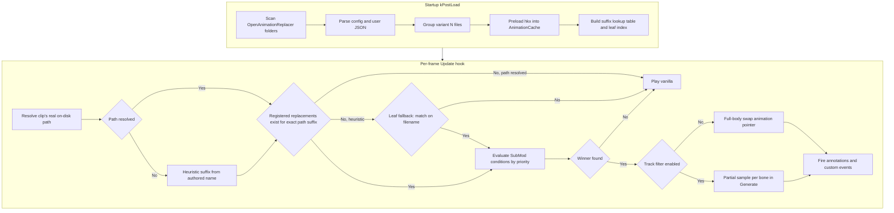
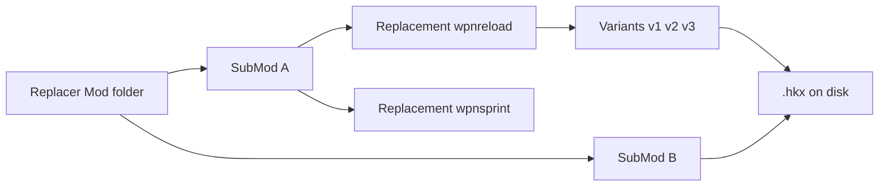
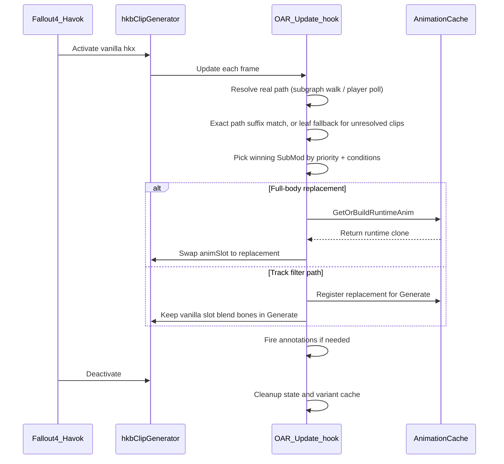
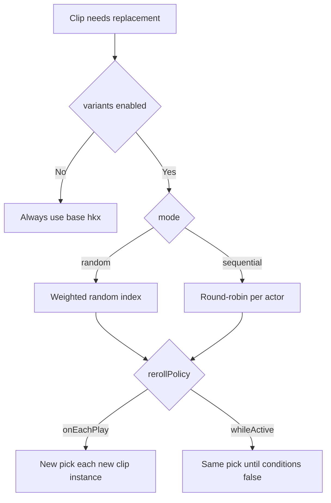
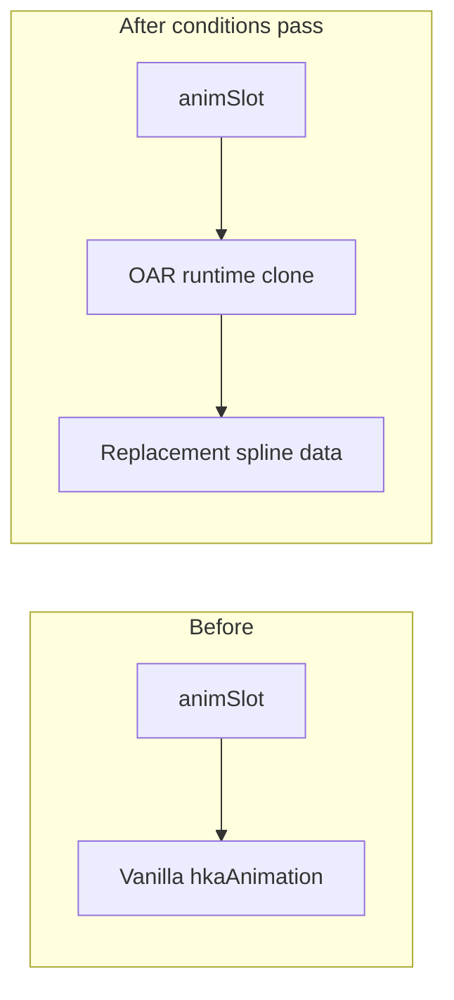
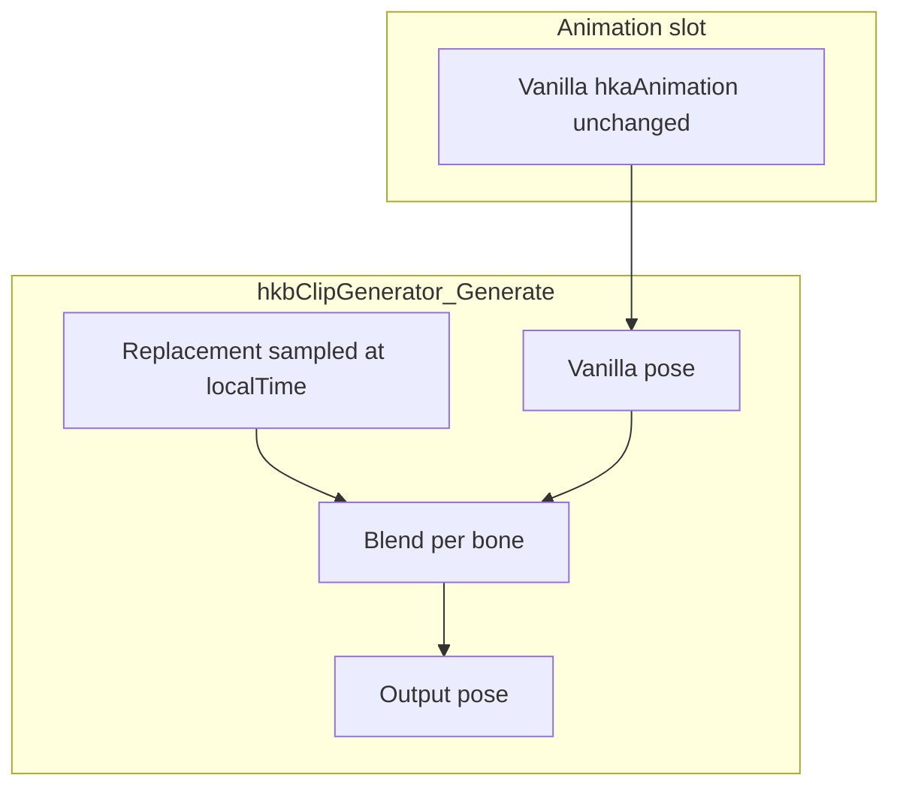
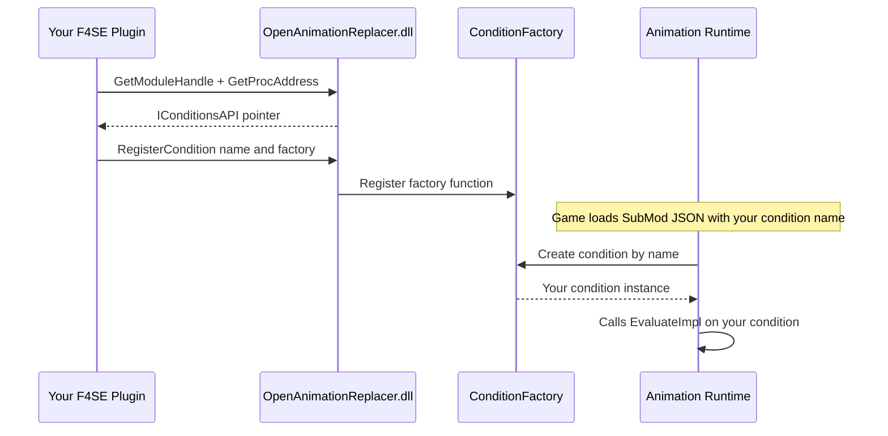

# Open Animation Replacer (Fallout 4)

[](https://github.com/DCCStudios/F4-OpenAnimationReplacer)

**Open Animation Replacer (OAR)** is an [F4SE](https://f4se.silverlock.org/) plugin that swaps Havok animation clips (`.hkx`) at runtime when configurable conditions are met. It is a Fallout 4 port of [Open Animation Replacer](https://github.com/Andrealphus-Mods/OpenAnimationReplacer) for Skyrim.

Use it to replace weapon reloads, idles, sprints, and other gameplay animations without editing the behavior graph, while still driving sounds and game events through Havok annotations.

---

## Table of contents

1. [Overview](#overview)
2. [How it works](#how-it-works)
3. [Installation](#installation)
4. [Content authoring](#content-authoring)
5. [Configuration reference](#configuration-reference)
6. [Variant animations](#variant-animations)
7. [Replacement modes](#replacement-modes)
8. [Conditions](#conditions)
9. [In-game UI](#in-game-ui)
10. [Plugin API (for developers)](#plugin-api-for-developers)
11. [Project layout (developers)](#project-layout-developers)
12. [Building from source](#building-from-source)
13. [Troubleshooting](#troubleshooting)
14. [Documentation](#documentation)
15. [Credits](#credits)

---

## Overview

| Concept | Meaning |
|---------|---------|
| **Replacer Mod** | Pack folder under `OpenAnimationReplacer/` |
| **SubMod** | One rule set: conditions + settings + `.hkx` files |
| **Suffix** | Match key = path after `Animations\` without `.hkx` (e.g. `scar\wpnreload`) |
| **Direct path matching** | Default. Match the clip's real on-disk path exactly |
| **Leaf fallback** | Match by filename only when the real path is unknown (or when legacy mode is on) |
| **Variant** | Several `.hkx` files (`base`, `base_1`, …) picked randomly or in sequence |
| **Conditions** | Rules for *when* a SubMod applies (weapon drawn, in combat, …) |
| **Priority** | Higher number wins when several SubMods match the same clip |

OAR hooks Havok clip generators at runtime and swaps in your `.hkx` when a SubMod wins.

---

## How it works

### High-level pipeline



### Matching mechanism

Default mode is **direct path matching** (`bDirectPathMatching=1` in the INI or Settings).
Leaf matching is only a fallback.

#### 1. Your file gets a suffix

Path after `Animations\`, extension removed:

| File in your SubMod | Suffix |
|---------------------|--------|
| `SCAR\WPNReload.hkx` | `scar\wpnreload` |
| `MT_Idle.hkx` | `mt_idle` |

#### 2. The game clip gets the same kind of suffix

OAR finds the clip's real on-disk path, then builds the same suffix.

| Game plays | Suffix |
|------------|--------|
| `...\Animations\SCAR\WPNReload.hkx` | `scar\wpnreload` |

Those two suffixes must match **exactly**. A SCAR reload mod will not apply to a
different weapon's reload just because both files are named `WPNReload.hkx`.

#### 3. If the real path is unknown → leaf fallback

OAR tries other clues (weapon folder, behavior name, etc.). If that still doesn't
match a registered path, it falls back to the **filename only** (`wpnreload`).

- One SubMod with that leaf → it matches.
- Several → conditions and priority decide.

Turn on legacy mode with `bDirectPathMatching=0` to use leaf matching for every clip.

#### 4. Conditions pick the winner

Candidates are tried highest priority first. First SubMod whose conditions all pass wins.
Each SubMod keeps its own cached `.hkx` and annotations, so the winner plays *its* file.

### Data hierarchy



### Clip evaluation (one animation playing)



---

## Installation

### End users

1. Install [F4SE](https://f4se.silverlock.org/) for your game version.
2. Place in `Fallout 4/Data/F4SE/Plugins/`:
   - `OpenAnimationReplacer.dll`
   - `OpenAnimationReplacer.ini` (optional; defaults apply if missing)
3. Install animation packs under `Data/Meshes/.../Animations/OpenAnimationReplacer/` (see [Content authoring](#content-authoring)).
4. Launch via `f4se_loader.exe`.

### Logs

| Log | Location |
|-----|----------|
| OAR plugin | `Documents/My Games/Fallout4/F4SE/OpenAnimationReplacer.log` |
| F4SE | `Documents/My Games/Fallout4/F4SE/f4se.log` |

---

## Content authoring

### Rule of thumb

**Mirror the path after `Animations\`.** Use the Animation Log to see the real path.

| Game path | Put your file at |
|-----------|------------------|
| `...\Animations\SCAR\WPNReload.hkx` | `<SubMod>\SCAR\WPNReload.hkx` |
| `...\Animations\MT_Idle.hkx` | `<SubMod>\MT_Idle.hkx` |

- **Path** = which animation is replaced  
- **Conditions** = when it is replaced  
- **Priority** = who wins if several SubMods match  

A flat `WPNReload.hkx` in the SubMod root only matches clips directly under
`Animations\`, or via leaf fallback / legacy mode (`bDirectPathMatching=0`).

### Folder structure

OAR looks for folders named `OpenAnimationReplacer` under `Data/Meshes/`.

```
Data/Meshes/Actors/Character/_1stPerson/Animations/   ← note the underscore
└── OpenAnimationReplacer/
    └── SCAR OAR Test/                 ← Replacer Mod (any name)
        ├── config.json                ← optional pack metadata
        └── SCAR Reload Test/          ← SubMod (any name)
            ├── config.json            ← conditions, priority, …
            ├── user.json              ← optional player overrides
            └── SCAR/                  ← mirrors ...\Animations\SCAR\
                ├── WPNReload.hkx
                ├── WPNReload_1.hkx
                └── …
```

### Matching rules

**Direct path matching (default)**

| Situation | Result |
|-----------|--------|
| Paths match (`scar\wpnreload` ↔ `SCAR\WPNReload.hkx`) | SubMod is evaluated |
| Real path known, but no SubMod for that exact suffix | No replacement (no leaf fallback) |
| Real path unknown | Leaf fallback (filename only) |
| Several SubMods share the suffix | Conditions + priority pick one |
| `"conditions": []` | Always matches that animation |

**Legacy leaf matching** (`bDirectPathMatching=0`): match by filename everywhere;
subfolders are optional; conditions + priority still break ties.

### Quick setup

1. Open the **Animation Log**, play the animation, copy the path after `Animations\`.
2. Create that same folder layout under your SubMod and drop in your `.hkx`.
3. Add conditions in `config.json` (empty = always on for that path).
4. Optional: variants (`WPNReload_1.hkx`, …) and a higher `priority` if other packs compete.

### Where to place the pack under Meshes

Put `OpenAnimationReplacer/` inside the animation tree you are targeting:

| Target | Typical path |
|--------|----------------|
| 1st person | `Data/Meshes/Actors/Character/_1stPerson/Animations/OpenAnimationReplacer/` |
| 3rd person | `Data/Meshes/Actors/Character/Animations/OpenAnimationReplacer/` |

OAR also scans `Actors/<race>/Character/Animations/` and, if needed, all of `Data/Meshes/`.

### Mod-level `config.json` (optional)

```json
{
  "name": "SCAR OAR Test",
  "author": "YourName",
  "description": "Custom SCAR reload and idle animations."
}
```

### SubMod `config.json` (core behavior)

```json
{
  "name": "SCAR Reload Test",
  "description": "Reload when magazine not empty.",
  "priority": 1000,
  "disabled": false,
  "interruptible": true,
  "replaceOnLoop": true,
  "replaceOnEcho": true,
  "replaceAnnotations": true,
  "conditions": [
    {
      "condition": "IsForm",
      "Form": { "pluginName": "Fallout4.esm", "formID": "0x14" }
    },
    {
      "condition": "CurrentMagazineAmmo",
      "comparison": 1,
      "numericValue": { "type": "Static", "value": 0.0 }
    },
    { "condition": "IsEquipped", "Form": { "pluginName": "SCAR-H.esp", "formID": "0x2E1F" } }
  ],
  "variants": {
    "enabled": true,
    "mode": "random",
    "rerollPolicy": "onEachPlay",
    "weights": {
      "WPNReload_1.hkx": 1.0,
      "WPNReload_2.hkx": 2.0,
      "WPNReload_3.hkx": 1.0
    }
  },
  "trackFilter": {
    "enabled": false,
    "mode": "override",
    "weight": 1.0,
    "blendInTime": 0.15,
    "blendOutTime": 0.15,
    "boneNames": ["LArm_Collarbone", "RArm_Collarbone"],
    "excludeBoneNames": []
  },
  "eventsOnStart": [],
  "eventsOnEnd": ["ReloadComplete"]
}
```

### SubMod fields (summary)

| Field | Type | Default | Description |
|-------|------|---------|-------------|
| `name` | string | folder name | Display name in UI |
| `priority` | int | 0 | Higher value wins when multiple SubMods match |
| `disabled` | bool | false | Skip entirely |
| `interruptible` | bool | false | Re-evaluate conditions every frame |
| `replaceOnLoop` | bool | true | Re-evaluate when clip loops |
| `replaceOnEcho` | bool | true | Re-evaluate on echo / blend |
| `replaceAnnotations` | bool | true | Use replacement annotations (may null triggers + manual fire) |
| `suppressAnnotations` | bool or string[] | -- | `true` mutes ALL of the replacement file's annotations; an array (e.g. `["WeaponFire", "SoundPlay.WPNRifleFire"]`) mutes only those, case-insensitive. Needs `replaceAnnotations: true`. Use for dry-fire/silent replacements whose source `.hkx` still carries annotations |
| `playOnceFullBody` | bool | false | Keep vanilla triggers until anim completes (state machine exit) |
| `deactivationDelay` | float | 0 | Seconds to hold replacement after conditions fail |
| `conditions` | array | `[]` | AND list; empty = always match |
| `variants` | object | -- | Variant selection settings (see below) |
| `trackFilter` | object | disabled | Partial-body bone override |
| `eventsOnStart` / `eventsOnEnd` | string[] | `[]` | Custom behavior graph events |

### User overrides (`user.json`)

Players can override author settings without editing `config.json`. The in-game UI writes `user.json` in the same SubMod folder; any field present overrides the author file.

```json
{
  "disabled": false,
  "priority": 500,
  "variants": { "enabled": true, "mode": "sequential" }
}
```

---

## Configuration reference

### Plugin INI -- `Data/F4SE/Plugins/OpenAnimationReplacer.ini`

| Section | Key | Default | Description |
|---------|-----|---------|-------------|
| **General** | `bEnabled` | `1` | Master enable |
| | `bEnableUI` | `1` | ImGui overlay |
| | `bAsyncParsing` | `1` | Background parse at load |
| | `bDisablePreloading` | `0` | Skip upfront `.hkx` preload |
| | `bFilterOutDuplicateAnimations` | `1` | Dedupe registration |
| | `bDirectPathMatching` | `1` | Exact path matching (default). `0` = leaf matching everywhere. Also in Settings |
| **UI** | `iToggleKey` | `60` (`0x3C`) | DIK scan code for UI toggle (default **F2**; rebind in Settings) |
| | `bRequireShift` | `0` | Require Shift + toggle key |
| **AnimationLog** | `bLogReplace` | `1` | Log replacements in overlay |
| | `iMaxLogEntries` | `100` | Log buffer size |
| **Limits** | `iAnimationLimit` | `16384` | Max registered replacements |
| | `iHavokHeapMultiplier` | `2` | Havok heap scaling hint |
| **Debug** | `bVerboseLogging` | `0` | Extra plugin logging |

---

## Variant animations

Variants let one replacement target (`wpnreload`) draw from several `.hkx` files with different motion, length, and annotations.

### File naming convention

| File | Role |
|------|------|
| `WPNReload.hkx` | Base animation (always included as variant index 0) |
| `WPNReload_1.hkx` | Variant 1 (`_` + digits after stem) |
| `WPNReload_2.hkx` | Variant 2 |
| `WPNReload_10.hkx` | Variant 10 |

**Requirements:**

- A **base** file (no `_N` suffix) must exist for `_N` files to be grouped as variants.
- Orphan `_N` files without a base are registered as standalone replacements.

### Internal cache keys

At parse time, variants receive synthetic cache suffixes so each file loads independently:

| Disk file | Cache suffix (example) |
|-----------|-------------------------|
| `scar\wpnreload.hkx` | `scar\wpnreload` |
| `scar\wpnreload_1.hkx` | `scar\wpnreload__v1` |
| `scar\wpnreload_2.hkx` | `scar\wpnreload__v2` |

### Selection modes



| `variants.mode` | Behavior |
|-----------------|----------|
| `random` | Weighted roll; optional `weights` per filename |
| `sequential` | Cycles 0, 1, 2, ... per actor |

| `variants.rerollPolicy` | Behavior |
|-------------------------|----------|
| `onEachPlay` | New selection when a **new** clip generator starts (each reload press) |
| `whileActive` | Same selection while SubMod conditions stay true |

| UI / future JSON | `shareRandomResults` | All actors share one roll (random mode only) |

### JSON example

```json
"variants": {
  "enabled": true,
  "mode": "random",
  "rerollPolicy": "onEachPlay",
  "weights": {
    "WPNReload_1.hkx": 1.0,
    "WPNReload_2.hkx": 3.0
  }
}
```

### Duration and annotations

Each variant loads its own `.hkx` into `AnimationCache` with its own **duration**, **tracks**, and **annotations**. Full-body replacement patches the cloned `hkaAnimation` duration so the engine loops at the replacement length. Annotation events (reload stages, sounds) are fired manually from the replacement clip's annotation list.

---

## Replacement modes

### Full-body replacement (default)



- Swaps the pointer at `animationControl -> binding -> animation`.
- Replacement **duration** and spline metadata are patched on the clone.
- Best for complete reload / idle / locomotion overrides.

**Caveat:** Hardcoded behavior graph **transitions** (e.g. "exit reload at 2.5s") still follow the `.hkb` graph, not your clip length. Use `playOnceFullBody` or `eventsOnEnd` where needed.

### Partial-body (track filter)



- Does **not** swap `animSlot`; samples the replacement per filtered bone.
- `trackFilter.boneNames` -- bones to override or additively blend.
- `blendInTime` / `blendOutTime` -- alpha ramp when conditions toggle.
- `localTime` is wrapped to the replacement duration when sampling (different-length clips).

| `trackFilter.mode` | Effect |
|--------------------|--------|
| `override` | Replace bone transform with replacement |
| `additive` | Add replacement on top of base pose |

---

## Conditions

SubMod conditions use **AND** logic at the root. Use `OR` / `AND` / `XOR` nodes and `negated` for complex logic.

**Evaluation order:** All SubMods matching the clip suffix are sorted by **priority (descending)**; the first whose condition set passes wins.

### Condition categories (registered types)

| Category | Examples |
|----------|----------|
| **Actor / combat** | `IsWeaponDrawn`, `IsInCombat`, `IsSprinting`, `IsADS`, `IsReloading`, `IsFiring`, `IsAttacking`, `IsBlocking` |
| **Movement** | `IsInAir`, `IsSneaking`, `IsRunning`, `IsSwimming`, `IsMovementDirection`, `MovementSpeed` |
| **Forms** | `IsForm`, `IsActorBase`, `IsEquipped`, `IsEquippedType`, `IsEquippedHasKeyword`, `HasKeyword` |
| **Ammo / equipment** | `CurrentMagazineAmmo`, `InventoryCount`, `IsWorn`, `IsWornHasKeyword` |
| **World** | `IsWorldSpace`, `IsParentCell`, `IsInLocation`, `IsInInterior`, `CurrentWeather`, `LightLevel` |
| **Animation** | `IsPlayingIdleAnimation`, `AnimProgress`, `AnimTimeElapsed`, `AnimTimeRemaining` |
| **Logic** | `OR`, `AND`, `XOR`, `Random`, `TARGET`, `PLAYER` |
| **Comparison** | `Level`, `CompareActorValue`, `Scale`, `FactionRank`, etc. |

Full parameter reference: **[docs/QuickStart.md](docs/QuickStart.md)**.

### Example: reload when magazine not empty

```json
{
  "condition": "CurrentMagazineAmmo",
  "comparison": 1,
  "numericValue": { "type": "Static", "value": 0.0 }
}
```

`comparison: 1` = Not Equal -- passes when ammo is not 0.

### Example: only while a specific idle plays

```json
{
  "condition": "IsPlayingIdleAnimation",
  "Form": { "pluginName": "SomeMod.esp", "formID": "0x12345" }
}
```

---

## In-game UI

| Input | Action |
|-------|--------|
| **F2** (default) | Toggle main overlay (`iToggleKey=0x3C`, `bRequireShift=0`). Rebind in Settings → Activation Key. |

### Modes

| Mode | Capabilities |
|------|----------------|
| **Inspect** | View mods, conditions, live pass/fail |
| **User** | Enable/disable SubMods, priorities -- saves `user.json` |
| **Author** | Edit conditions, variants, track filter -- saves `config.json` |

### Windows

- **Replacer tree** -- mods, submods, replacement list (variant count shown).
- **Condition editor** -- add/remove/negate; form pickers for idle/weapon records.
- **Variant settings** -- enable, random/sequential, reroll policy, weight sliders.
- **Active Replacements** -- debug view of current swaps (includes variant suffix).
- **Animation Log** -- real-time activate/replace/loop events.

---

## Plugin API (for developers)

OAR exposes two C++ APIs for other F4SE plugins:

- **Conditions API** (`RequestPluginAPI_Conditions`) — register custom condition types at runtime, adding entirely new conditions without modifying OAR's source code.
- **Clips API** (`RequestPluginAPI_Clips`) — query live data about the animation clips OAR handles: names, resolved file paths, durations, playback state, perspective, replacement attribution, annotations, and more. See [Clips API](#clips-api--query-live-clip-data) below.

### Architecture



### Quick Start

1. **Copy two SDK headers** into your project (from OAR's `src/API/` folder):
   - `OpenAnimationReplacerAPI-Conditions.h` — API interface + `GetAPI()` helper
   - `OpenAnimationReplacer-ConditionTypes.h` — `ConditionBase`, components, utilities

2. **Create your condition class** (inherit `OAR::ConditionBase`):

```cpp
#include "OAR/OpenAnimationReplacerAPI-Conditions.h"

class IsNearWaterCondition : public OAR::ConditionBase
{
public:
    std::string GetName() const override { return "IsNearWater"; }
    std::string GetDescription() const override {
        return "True when actor is within range of a water surface.";
    }

protected:
    bool EvaluateImpl(RE::TESObjectREFR* a_refr, RE::hkbClipGenerator*,
                      const OAR::SubMod*) const override
    {
        if (!a_refr) return false;
        // Your custom logic here
        float waterLevel = /* ... */;
        float actorZ = a_refr->data.location.z;
        float diff = actorZ - waterLevel;
        return OAR::CompareValues(diff, comparison, numericValue.GetValue(a_refr));
    }

    void InitializeImpl(const nlohmann::json& j) override {
        if (j.contains("comparison"))
            comparison = static_cast<OAR::ComparisonOperator>(j["comparison"].get<int>());
        if (j.contains("numericValue"))
            numericValue.Initialize(j["numericValue"]);
    }

    void SerializeImpl(nlohmann::json& j) const override {
        j["comparison"] = static_cast<int>(comparison);
        nlohmann::json nv;
        numericValue.Serialize(nv);
        j["numericValue"] = nv;
    }

private:
    OAR::ComparisonOperator comparison{ OAR::ComparisonOperator::kLess };
    OAR::NumericComponent numericValue;
};
```

3. **Register during `kPostLoad`**:

```cpp
#include "OAR/OpenAnimationReplacerAPI-Conditions.h"

void OnMessage(F4SE::MessagingInterface::Message* msg)
{
    if (msg->type == F4SE::MessagingInterface::kPostLoad) {
        auto* api = OAR::Conditions::GetAPI();
        if (!api) {
            logger::error("OAR not found!");
            return;
        }

        auto result = api->RegisterCondition("IsNearWater",
            [] { return std::make_unique<IsNearWaterCondition>(); });

        if (result == OAR::Conditions::APIResult::OK)
            logger::info("IsNearWater condition registered!");
    }
}
```

4. **Use in JSON configs** — content authors can now reference your condition:

```json
{
  "condition": "IsNearWater",
  "comparison": 4,
  "numericValue": { "type": "Static", "value": 200.0 }
}
```

### What You Get For Free

By inheriting `OAR::ConditionBase`, your condition automatically has:

- **Negation** — users can set `"negated": true` in JSON to invert your result
- **Disable** — `"disabled": true` makes the condition always pass
- **JSON envelope** — OAR handles the `"condition"` key, `"negated"`, `"disabled"` fields
- **UI integration** — your condition appears in OAR's in-game ImGui editor
- **Evaluation caching** — `lastEvalResult` is tracked for debug overlay display
- **Error handling** — exceptions during Initialize are caught and logged

### Available Components

The SDK headers provide these reusable building blocks:

| Component | Purpose | Example |
|-----------|---------|---------|
| `OAR::ComparisonOperator` | Enum for ==, !=, >, >=, <, <= | `CompareValues(a, op, b)` |
| `OAR::NumericComponent` | Value from static/global/actor-value | `numericValue.GetValue(refr)` |
| `OAR::FormComponent` | Resolve a form by plugin+localID | `form.ResolveForm(); form.cachedForm` |
| `OAR::ConditionSet` | Embed child conditions (composite) | `childConditions.EvaluateAll(...)` |

### API Reference

```cpp
namespace OAR::Conditions {
    // Get the API (returns nullptr if OAR not loaded)
    IConditionsAPI* GetAPI();

    class IConditionsAPI {
        // API version (currently 2)
        uint32_t GetAPIVersion() const;

        // Register a new condition type
        // Returns: OK, AlreadyRegistered, Invalid, or Failed
        APIResult RegisterCondition(const char* name, ConditionFactoryFn factory);

        // Remove a previously registered condition
        bool UnregisterCondition(const char* name);

        // Total registered condition count (built-in + custom)
        uint32_t GetRegisteredConditionCount() const;
    };

    // Factory function signature
    using ConditionFactoryFn = std::unique_ptr<OAR::ICondition>(*)();
}
```

### Timing

- Call `GetAPI()` during `kPostLoad` or `kPostPostLoad` messaging
- OAR loads SubMod configs after all plugins have loaded, so your conditions will be available
- Do NOT call `GetAPI()` during `F4SEPlugin_Load` (OAR may not be loaded yet)

### Advanced: Composite Conditions

For conditions that contain child conditions (like `DetectedBy` / `Detects`):

```cpp
class MyCompositeCondition : public OAR::ConditionBase
{
protected:
    bool EvaluateImpl(RE::TESObjectREFR* a_refr, RE::hkbClipGenerator* a_clip,
                      const OAR::SubMod* a_sub) const override
    {
        // Evaluate children against a different target
        RE::TESObjectREFR* otherRefr = /* get alternate target */;
        return childConditions.EvaluateAll(otherRefr, a_clip, a_sub);
    }

    void InitializeImpl(const nlohmann::json& j) override {
        if (j.contains("conditions") && j["conditions"].is_array()) {
            for (const auto& cj : j["conditions"]) {
                // Use OAR's factory to create child conditions
                // (requires forward-declaring CreateConditionFromJson)
            }
        }
    }

private:
    OAR::ConditionSet childConditions;
};
```

### Custom UI (Optional)

Override `DrawEditWidgets` for custom ImGui controls in the OAR editor:

```cpp
void DrawEditWidgets(bool& a_dirty) override {
    static const char* ops[] = { "==", "!=", ">", ">=", "<", "<=" };
    int idx = static_cast<int>(comparison);
    if (ImGui::Combo("Operator", &idx, ops, 6)) {
        comparison = static_cast<OAR::ComparisonOperator>(idx);
        a_dirty = true;
    }
    if (ImGui::InputFloat("Threshold", &numericValue.staticValue)) {
        a_dirty = true;
    }
}
```

### Clips API — query live clip data

Besides registering conditions, plugins can query everything OAR knows about the animation clips playing on an actor: authored names, resolved on-disk paths, playback state, perspective, replacement attribution, annotations, plus the active-replacement list and global stats.

**Setup:** copy `src/API/OpenAnimationReplacerAPI-Clips.h` into your project. It is fully self-contained — no CommonLibF4 or nlohmann-json required.

```cpp
#include "OAR/OpenAnimationReplacerAPI-Clips.h"

// MAIN THREAD ONLY — the queries walk live Havok graphs.
void DumpPlayerClips()
{
    auto* api = OAR::Clips::GetAPI();     // nullptr if OAR isn't loaded
    if (!api) return;

    OAR::Clips::ClipInfo clips[64];
    uint32_t total = api->GetActorClips(0 /* 0 = player */, clips, 64);
    for (uint32_t i = 0; i < std::min<uint32_t>(total, 64); ++i) {
        auto& c = clips[i];
        // c.animationName   — authored clip path (may be a template until resolved)
        // c.resolvedPath    — real on-disk path ("" until the engine data resolves)
        // c.duration        — length (s) of the animation currently playing
        // c.localTime       — current playback position (s)
        // c.playbackMode    — single-play / looping / user / ping-pong
        // c.perspective     — first person / third person / unknown
        // c.replacementKind — none / full-body swap / track filter
        // c.subModName, c.modName, c.subModPriority, c.replacementPath
    }
}
```

**Interface** (`OAR::Clips::IClipsAPI`, version 1):

| Method | Purpose |
|--------|---------|
| `GetActorClips(formID, buf, max)` | Enumerate active clips on an actor (`0`/`0x14` = player). Returns the TOTAL count, fills up to `max`. |
| `FindClip(formID, nameOrLeaf, out)` | Find one clip by file-name leaf (case-insensitive, `.hkx` optional), matched against suffix, authored name, and resolved path. |
| `GetClipAnnotations(clipHandle, buf, max)` | Annotations `(time, text)` of the animation the clip is *currently* playing — the replacement's when replaced. |
| `GetActiveReplacements(formID, buf, max)` | Snapshot of applied replacements (`0` = all actors) with submod, paths, actor name. |
| `GetStats(&stats)` | Loaded mod/submod/animation counts, runtime cache size, active replacement count. |

#### `ClipInfo` field reference

| Field | Type | Meaning |
|-------|------|---------|
| `clipHandle` | `uint64_t` | Opaque clip generator id. **Valid only within the frame it was returned** — pass it to `GetClipAnnotations` the same frame, never store it. |
| `actorFormID` | `uint32_t` | Owning actor's form ID (`0x14` = player). |
| `graphIndex` | `uint8_t` | Which of the actor's animation graphs the clip lives in (the player has separate 1st/3rd-person graphs). |
| `perspective` | `uint8_t` | `kPerspectiveFirstPerson`, `kPerspectiveThirdPerson`, or `kPerspectiveUnknown`. |
| `playbackMode` | `uint8_t` | `kModeSinglePlay`, `kModeLooping`, `kModeUserControlled`, `kModePingPong`. |
| `replacementKind` | `uint8_t` | `kReplacementNone`, `kReplacementFullBody` (OAR swapped the slot animation), or `kReplacementTrackFilter` (OAR overlays specific bones; slot holds the original). |
| `duration` | `float` | Length in seconds of the animation **currently playing** (the replacement's length when replaced). |
| `localTime` | `float` | Current playback position in seconds. `localTime / duration` gives normalized progress. |
| `playbackSpeed` | `float` | Clip playback rate multiplier. |
| `originalDuration` | `float` | The original animation's length. Equals `duration` when unreplaced; `0` when unknown. |
| `subModPriority` | `int32_t` | Priority of the active submod (`0` when none). |
| `animationName` | `char[128]` | Authored clip animation path. May be a **template** (e.g. `44pistol\wpnfire.hkx`) until the engine's real path resolves. |
| `resolvedPath` | `char[260]` | Real on-disk path resolved from the engine's subgraph data. Empty until resolution succeeds (player weapon clips resolve within a few frames of activation). |
| `suffix` | `char[128]` | OAR's matching suffix: the path after `Animations\`, no extension. This is the key OAR matches replacement folders against. |
| `subModName` / `modName` | `char[128]` | Active replacement's submod and its parent replacer mod. Empty when no replacement is active. |
| `replacementPath` | `char[260]` | The replacement `.hkx` path being played. Empty when none. |

All strings are null-terminated and truncated to the buffer size when longer. Empty string means "not known / not applicable", never garbage.

#### More query examples

React to the annotations of whatever animation is actually playing (replacement annotations included):

```cpp
OAR::Clips::ClipInfo clip;
if (api->FindClip(0, "wpnfiresingleready", &clip)) {
    OAR::Clips::ClipAnnotation annots[32];
    uint32_t n = api->GetClipAnnotations(clip.clipHandle, annots, 32);
    for (uint32_t i = 0; i < std::min<uint32_t>(n, 32); ++i) {
        // annots[i].time (seconds from clip start), annots[i].text ("WeaponFire", ...)
        // e.g. schedule something for when playback reaches the annotation:
        float secondsUntil = (annots[i].time - clip.localTime) / std::max(clip.playbackSpeed, 0.001f);
    }
}
```

Check whether OAR is currently replacing anything on an actor (e.g. to avoid conflicting with it):

```cpp
uint32_t count = api->GetActiveReplacements(someActorFormID, nullptr, 0); // count only
if (count > 0) {
    std::vector<OAR::Clips::ActiveReplacementInfo> reps(count);
    api->GetActiveReplacements(someActorFormID, reps.data(), count);
    // reps[i].subModName, reps[i].replacementPath, reps[i].clipSuffix, ...
}
```

Two-call pattern for buffers of unknown size (works for all enumeration methods — they return the TOTAL count regardless of how much was written):

```cpp
uint32_t total = api->GetActorClips(0, nullptr, 0);       // 1st call: count
std::vector<OAR::Clips::ClipInfo> clips(total);
api->GetActorClips(0, clips.data(), total);               // 2nd call: fill
```

Global stats (e.g. for a diagnostics overlay):

```cpp
OAR::Clips::Stats stats{};
if (api->GetStats(&stats)) {
    // stats.replacerModCount, stats.subModCount, stats.replacementAnimCount,
    // stats.cachedAnimFileCount, stats.activeReplacementCount
}
```

**Rules:**

- Call every method from the **game's main thread** (e.g. an F4SE task or your own update hook). The clip queries walk live Havok graph structures; calling from another thread races the engine.
- `clipHandle` values are only valid within the frame they were returned — don't store them.
- `GetAPI()` works at `kPostLoad` or later; the returned pointer may be cached for the session.
- Queries are on-demand walks, not cached — cheap enough per frame for one actor, but don't enumerate every loaded actor every frame.
- Check `GetAPIVersion()` once after `GetAPI()` if you depend on fields added in later versions (current: 1).

### Build Requirements for API Plugins

- Visual Studio 2022 (MSVC, x64)
- CommonLibF4 (same version OAR links against; **not** needed for the Clips API header)
- nlohmann-json (header-only, same version; **not** needed for the Clips API header)
- C++23 standard
- `x64-windows-static-md` vcpkg triplet (matching OAR)

---

## Project layout (developers)

```
OpenAnimationReplacer/
|-- CMakeLists.txt          # Build + CommonLibF4 link
|-- CMakePresets.json       # msvc-release / msvc-debug
|-- OpenAnimationReplacer.ini
|-- README.md
|-- docs/
|   |-- QuickStart.md       # Authoring + conditions (detailed)
|   |-- HavokReference.md
|   +-- HavokReference2.md
|-- src/
|   |-- main.cpp            # F4SE entry, messaging
|   |-- Hooks.cpp           # hkbClipGenerator hooks, track filter, variants
|   |-- Parsing.cpp         # Disk scan, variant grouping, JSON
|   |-- AnimationCache.cpp  # .hkx load, runtime clone, annotations
|   |-- Variants.cpp        # Random/sequential selection
|   |-- Conditions.cpp      # Condition implementations
|   |-- ReplacerMods.h      # SubMod, TrackFilter, variant settings
|   |-- OpenAnimationReplacer.cpp  # Path map, DB injection
|   +-- UI/                 # ImGui (UIManager, UIMain, debug overlay)
+-- Compile/F4SE/Plugins/   # Build output (OpenAnimationReplacer.dll)
```

### Key runtime components

| Component | Responsibility |
|-----------|----------------|
| `Parsing` | Discover `.hkx`, group variants, read JSON |
| `OpenAnimationReplacer` | `animPathToReplacementsMap`, bundle injection |
| `AnimationCache` | Load packfile/tagfile, build runtime clones |
| `Hooks` | Condition eval, swap or track-filter, annotation firing |
| `Variants` | Per-actor / per-clip selection state |
| `ActiveReplacementTracker` | Debug overlay entries |

---

## Building from source

### Prerequisites

| Tool | Notes |
|------|-------|
| **Visual Studio 2022** | x64, Desktop development with C++ |
| **CMake** | >= 3.21 |
| **vcpkg** | `VCPKG_ROOT` set; triplet `x64-windows-static-md` |
| **CommonLibF4** | Expected at `../PluginTemplate/CommonLibF4` (adjust `CMakeLists.txt` if needed) |
| **Fallout4Path** | Environment variable -- game root |

### Commands

```powershell
cd OpenAnimationReplacer
cmake --preset msvc-release
cmake --build build/release --config Release
```

**Output:** `Compile/F4SE/Plugins/OpenAnimationReplacer.dll`

Copy the DLL and `OpenAnimationReplacer.ini` to `Data/F4SE/Plugins/`.

### vcpkg manifest

Dependencies are declared in `vcpkg.json` (e.g. `spdlog`, `nlohmann-json`, `imgui`).

---

## Troubleshooting

| Symptom | Things to check |
|---------|------------------|
| **No replacement in game** | `bEnabled=1`; conditions in log (`OpenAnimationReplacer.log`); priority vs other SubMods; correct `_1stPerson` path |
| **Only one variant plays** | `variants.enabled`; `rerollPolicy`; ensure multiple `_N` files + base exist |
| **Reload anim cancels mid-play** | Often interruptible SubMod or competing priority; check transition logs |
| **Ammo updates but no visible anim** | Conditions pass but clip swap failed -- check cache load errors in log |
| **No sound / reload events** | `replaceAnnotations`; annotation times in replacement `.hkx`; `eventsOnEnd` |
| **Crash at startup in ReadBoundAnimDataBinary** | Usually corrupt/unrelated `.hkx` in load order -- not OAR hook code; test without animation packs |
| **Track filter looks wrong** | Bone names must match skeleton; try `override` vs `additive`; check blend times |

Enable `bVerboseLogging=1` and inspect `[OAR-Transition]`, `[OAR-Variant]`, `[OAR-Cache]` lines.

---

## Documentation

| Document | Contents |
|----------|----------|
| [docs/ConditionReference.md](docs/ConditionReference.md) | Complete list of all 97 conditions with parameters and examples |
| [docs/QuickStart.md](docs/QuickStart.md) | Step-by-step authoring, full condition list, examples |
| [docs/HavokReference.md](docs/HavokReference.md) | Struct offsets and Havok notes |
| [docs/HavokReference2.md](docs/HavokReference2.md) | Additional Havok / clip generator notes |

Parent workspace (if present): `F4SE_Plugin_Development_Reference.md` for F4SE plugin conventions.

---

## Credits

- **Original Skyrim mod:** [Open Animation Replacer](https://github.com/Andrealphus-Mods/OpenAnimationReplacer) -- Andrealphus-Mods
- **Fallout 4 port:** [DCC Studios](https://github.com/DCCStudios/F4-OpenAnimationReplacer) / contributors
- **CommonLibF4:** Ryan-rsm-McKenzie and contributors

---

## License

See repository license when published. The Skyrim original remains under its upstream license.
